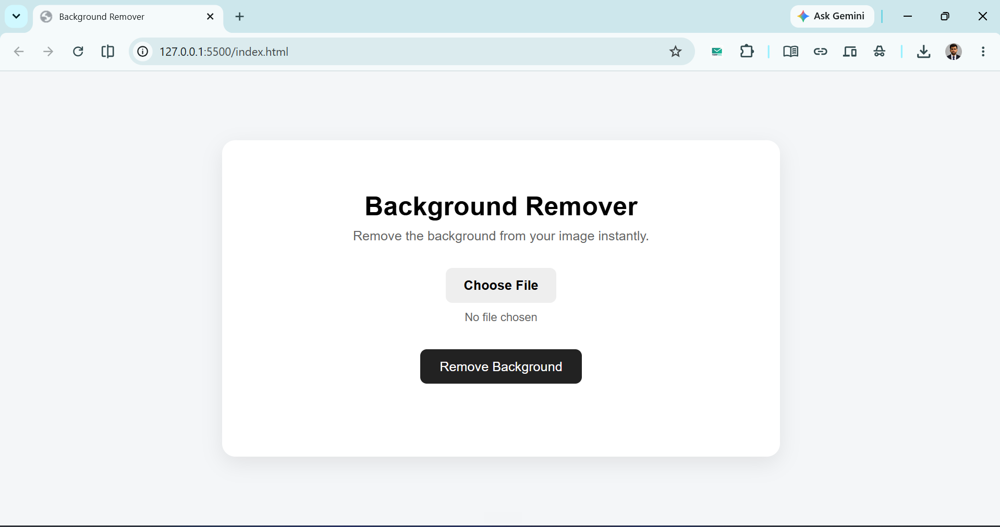

# Background Remover

A simple web app that removes the background from an uploaded image and returns a transparent PNG.

## Preview

### Uploaded Image



### Downloaded Result


## Run the project

You need Python installed on your computer.

From the project folder, open PowerShell and run:

```powershell
cd backend
python -m venv env
.\env\Scripts\Activate.ps1
pip install -r requirements.txt
uvicorn api.main:app --reload
```

Keep the terminal running while using the app.

Open `index.html` in your browser to use the frontend.

The backend runs at:

```text
http://127.0.0.1:8000
```

## API

- `GET /health` checks whether the backend is running.
- `POST /remove-bg` accepts an image and returns the image with its background removed.

## Project structure

```text
background-remover/
├── index.html
├── styles.css
├── app.js
└── backend/
    ├── api/main.py
    └── requirements.txt
```

Do not upload the `backend/env` folder to GitHub. It is created locally when you set up the project.
